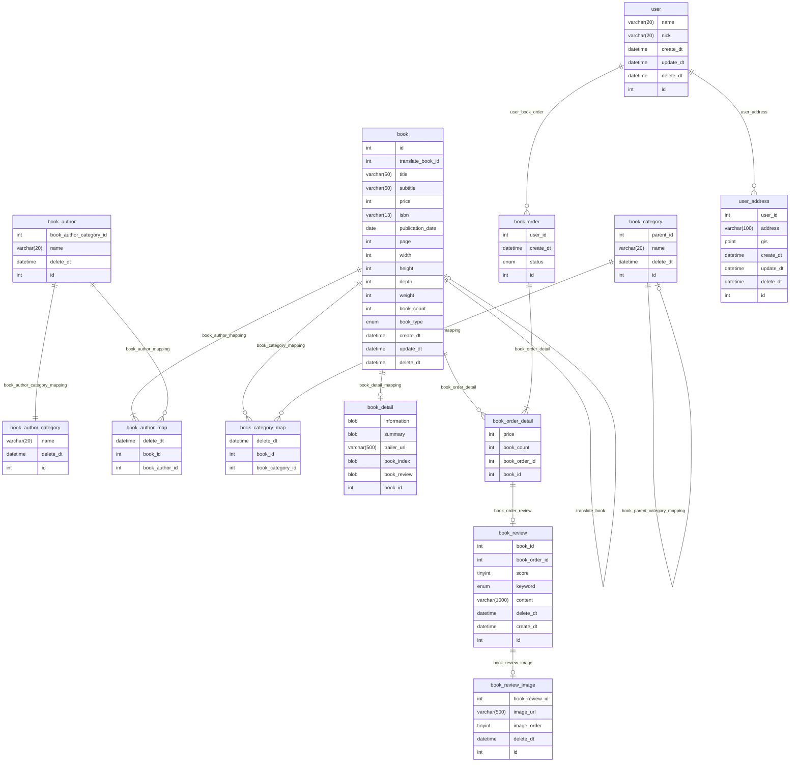

# 온라인 도서 주문 서비스 DB

## 구축 환경

OS : MAC

MYSQL VERSION : 8.0.31

## 모델링

## 더미 데이터 삽입용 Stored Procedure 작성

> 더미 데이터를 생성하고 삽입하는 과정을 자동화 하는 테이블 별 Stored Procedure 를 작성하였음

### Stored Procedure 리스트(cd : create_dummy)
1. cd_book
2. cd_book_author
3. cd_book_author_category
4. cd_book_category
5. cd_book_category_map
6. cd_book_order
7. cd_book_review
8. cd_user
9. cd_user_address

### Stored Procedure 작성 중 신경쓴 점

#### 메모리 과적 방지를 위한 트랜잭션 분리

##### 트랜잭션 분리를 하지 않았을 때 문제점
MySQL은 AUTOCOMMIT이 활성화 상태라면 모든 statement를 실행한 후 자동으로 commit 한다. 하지만 Commit 을 반복적으로 실행할 경우 트랜잭션을
열고 닫는 오버헤드가 누적되어 성능에 영향을 미칠 것이다. 그래서 고안한 것이 AUTOCOMMIT을 끄고 여러 statement를 한번에 commit하는 것이다. 
하지만 트랜잭션 동안 발생한 데이터 삽입/변경/삭제는 mtr의 내부 버퍼에 저장된 후 commit이 이뤄지면 log buffer로 보내지고 
백그라운드 스레드에 의해 log file에 기록되게 된다. 
따라서 한 번에 너무 많은 데이터를 하나의 트랜잭션으로 처리하게 된다면 메모리에 모든 레코드를 저장해놓고 있어야하기 때문에 메모리 낭비가 심하다.

##### 트랜잭션 분리 후
이를 해결하기 위해 일정 레코드 수 마다 트랜잭션을 분리했다. 
일정한 레코드 수 마다 트랜잭션을 분리하게 된다면 적은 메모리 공간으로도 충분히 빠른 속도로 데이터를 저장할 수 있다.

다른 스키마에서 데이터 예상 용량이 4GB인 1억개 가량의 데이터를 하나의 트랜잭션으로 삽입했을 때 mysqld 프로세스가 7GB 이상의 메모리 공간을 차지하고 있었다.
하지만 book_order 테이블에 5000만개의 데이터와 book_order_detail 테이블에 1억 2천만개의 데이터를 넣으면서 트랜잭션 분리 기준을 100만 개로 설정했더니
mysqld 프로세스의 메모리 사용량은 634mb ~ 830mb 사이를 왔다갔다 하였다.